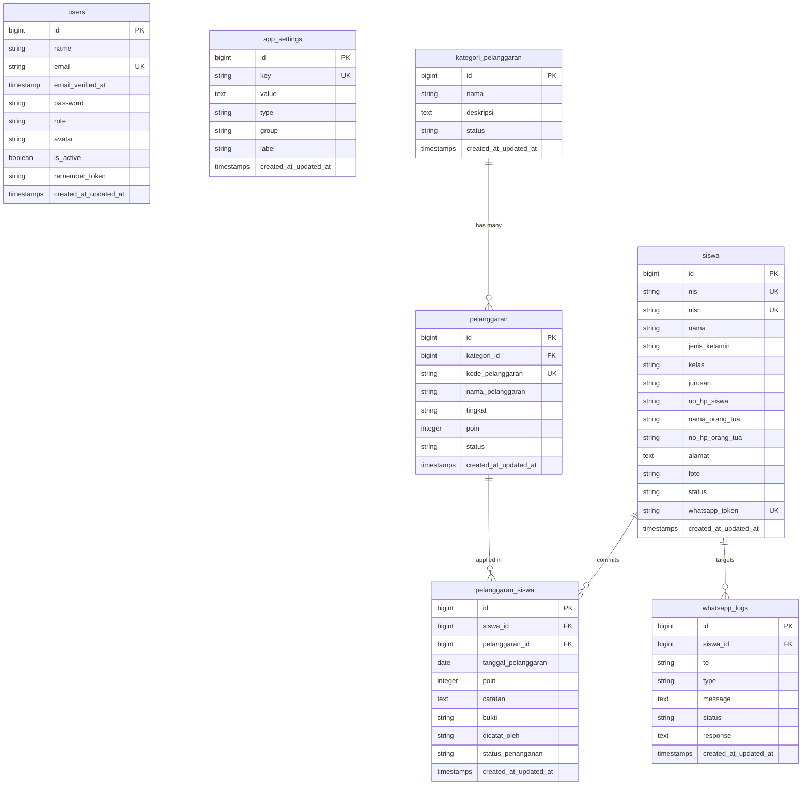

# Dokumentasi Sistem Informasi Pelanggaran Siswa (SIPRES)

Sistem Informasi Pelanggaran Kedisiplinan Siswa (SIPRES) adalah aplikasi berbasis web yang dikembangkan menggunakan **Laravel 11**, **Metronic 8 (Bootstrap 5)**, **jQuery DataTables**, dan **WhatsApp API Gateway** pihak ketiga. Aplikasi ini dirancang untuk mencatat, mengolah, menyajikan data pelanggaran siswa, serta mengirimkan laporan secara otomatis/manual kepada orang tua/wali murid secara real-time.

---

## 1. Peta Fitur Utama (Features Map)

Aplikasi ini memiliki 7 modul utama dengan fungsi sebagai berikut:

### A. Dashboard & Statistik
* **Ringkasan Data**: Menampilkan counter total siswa, total pelanggaran tercatat, persentase penyelesaian laporan, dan status WhatsApp API.
* **Grafik Interaktif**: Chart tren bulanan jumlah pelanggaran dan chart pie pembagian pelanggaran per tingkat (Ringan, Sedang, Berat).
* **Selamat Datang Personal**: Sambutan dinamis kepada pengguna yang sedang login berdasarkan waktu (Pagi/Siang/Sore/Malam).

### B. Manajemen Kategori & Jenis Pelanggaran
* **Kategori Pelanggaran**: Mengelompokkan jenis pelanggaran (misalnya: Kerapian, Kerajinan, Sikap, Pelanggaran Khusus).
* **Jenis Pelanggaran**: Detail aturan pelanggaran lengkap dengan Kode Pelanggaran, Tingkat (Ringan/Sedang/Berat), Poin Pengurangan Kedisiplinan, dan Status Keaktifan.

### C. Manajemen Data Siswa
* **Profil Siswa**: Pencatatan NIS, NISN, Nama, Kelas, Jurusan, Detail Orang Tua, No HP Orang Tua, Foto, dan Status Keaktifan.
* **Poin & Status Kedisiplinan**: Akumulasi poin pelanggaran siswa terhitung secara otomatis dengan status pembinaan:
  * **Aman** (0-25 Poin)
  * **Perhatian** (26-50 Poin)
  * **Pembinaan** (51-75 Poin)
  * **Panggilan Orang Tua** (76-100 Poin)
  * **Rekomendasi Tindakan Khusus** (>100 Poin)
* **Riwayat Laporan & Kirim WA**: Akses cepat ke riwayat privat siswa dan tombol kirim tautan laporan ke WhatsApp orang tua secara mandiri.

### D. Pencatatan Riwayat Pelanggaran (Log Pelanggaran)
* **Pencatatan Baru**: Formulir pencatatan lengkap dengan pemilihan Siswa Aktif, Jenis Pelanggaran Aktif, Tanggal Kejadian, Catatan Keterangan, Unggah Bukti File (Foto/PDF), dan Status Penanganan awal.
* **Notifikasi Otomatis**: Secara otomatis mengirimkan pesan WhatsApp berisi rincian pelanggaran dan tautan riwayat privat ke nomor orang tua sesaat setelah data berhasil disimpan di sistem.

### E. Laporan & Cetak Ekspor
* **Filter Multifungsi**: Filter rentang tanggal, kategori, jenis, kelas, jurusan, status penanganan, tingkat pelanggaran, dan status keaktifan siswa.
* **Cetak PDF**: Download laporan berformat PDF lanskap A4 siap cetak.
* **Ekspor Excel**: Download rekapitulasi data dalam format Microsoft Excel (.xlsx).
* **Daftar Laporan Terbagi**:
  * Laporan Pelanggaran per Siswa (Server-side Table)
  * Rekap Laporan Bulanan
  * Rekap Laporan per Kategori / per Jenis / per Kelas / per Status Penanganan
  * Ranking Siswa Pelanggar (Poin Tertinggi)

### F. Konfigurasi WhatsApp API Gateway
* **Konfigurasi Dinamis**: Simpan kredensial API secara aman di database (Base URL, Bearer Token, Session ID, dan Nomor Pengirim).
* **Health API Check**: Menguji status online/offline server API dan memeriksa status keaktifan sesi WhatsApp.
* **Uji Kirim Pesan**: Kirim pesan percobaan secara bebas untuk memvalidasi konfigurasi.
* **Penyuntingan Template**: Pengaturan isi template notifikasi dengan placeholder otomatis (seperti `{nama_siswa}`, `{nama_pelanggaran}`, `{total_poin}`, dll).
* **Log Logistik WhatsApp**: Mencatat seluruh data pengiriman WhatsApp secara lengkap untuk monitoring keberhasilan, kegagalan, atau nomor kosong.

### G. Halaman Riwayat Publik Orang Tua
* **Akses Publik Tanpa Login**: Halaman privat khusus yang dapat diakses oleh orang tua di luar modul admin melalui token rahasia unik (`/laporan-siswa/{token}`).
* **Visual Mewah & Responsif**: Menampilkan rangkuman statistik poin kedisiplinan anak, info tindak lanjut sekolah, dan daftar kronologis pelanggaran secara mobile-friendly.

---

## 2. Struktur Database (ERD)

Aplikasi memiliki 7 tabel inti yang saling berelasi. Berikut representasi skema database:



### Relasi Kunci (Foreign Keys):
1. `pelanggaran.kategori_id` merujuk ke `kategori_pelanggaran.id` (Relasi One-to-Many).
2. `pelanggaran_siswa.siswa_id` merujuk ke `siswa.id` dengan relasi Cascade/Restrict.
3. `pelanggaran_siswa.pelanggaran_id` merujuk ke `pelanggaran.id`.
4. `whatsapp_logs.siswa_id` merujuk ke `siswa.id` dengan relasi `nullOnDelete()`.

---

## 3. Struktur Direktori (Folder Structure)

Struktur file dan folder proyek Laravel ini mengikuti pola standar MVC (Model-View-Controller) dengan penambahan kelas Services dan Helpers khusus:

```text
pelanggaran-siswa/
│
├── app/
│   ├── Helpers/
│   │   └── helpers.php                 # Global helper functions (e.g. app_setting())
│   │
│   ├── Http/
│   │   ├── Controllers/
│   │   │   ├── Admin/
│   │   │   │   ├── PelanggaranSiswa/
│   │   │   │   │   ├── DashboardController.php      # Dashboard statistik pelanggaran
│   │   │   │   │   ├── KategoriPelanggaranController.php
│   │   │   │   │   ├── LaporanPelanggaranController.php # Laporan PDF/Excel & AJAX Laporan
│   │   │   │   │   ├── PelanggaranController.php        # Jenis pelanggaran
│   │   │   │   │   ├── PelanggaranSiswaController.php   # Catatan riwayat pelanggaran
│   │   │   │   │   └── SiswaController.php             # Siswa & WhatsApp manual trigger
│   │   │   │   │
│   │   │   │   ├── AppSettingController.php    # Konfigurasi sistem & Whatsapp AJAX
│   │   │   │   └── UserController.php          # Manajemen admin/user
│   │   │   │
│   │   │   ├── Auth/
│   │   │   │   └── LoginController.php         # Login autentikasi
│   │   │   │
│   │   │   └── PublicLaporanController.php     # Menampilkan riwayat laporan publik
│   │   │
│   │   └── Middleware/
│   │       └── AdminMiddleware.php             # Proteksi halaman admin
│   │
│   ├── Models/
│   │   ├── AppSetting.php              # Model konfigurasi aplikasi
│   │   ├── KategoriPelanggaran.php     # Model kategori pelanggaran
│   │   ├── Pelanggaran.php             # Model peraturan pelanggaran
│   │   ├── PelanggaranSiswa.php        # Model catatan pelanggaran siswa
│   │   ├── Siswa.php                   # Model profil siswa & token generator
│   │   ├── User.php                    # Model admin / guru
│   │   └── WhatsAppLog.php             # Model log pengiriman WhatsApp
│   │
│   └── Services/
│       ├── LaporanFilterService.php    # Layanan filter & query generator laporan
│       └── WhatsAppService.php         # Integrasi API WA, health, send & format templates
│
├── database/
│   ├── migrations/                     # Migrasi tabel (Siswa, Pelanggaran, Logs, Settings)
│   └── seeders/                        # Seeders data awal (Settings, Users, Dummy Siswa)
│
├── resources/
│   └── views/
│       ├── admin/
│       │   ├── pelanggaran-siswa/      # Folder view modul pelanggaran siswa
│       │   │   ├── kategori/           # CRUD Kategori Pelanggaran (Index AJAX)
│       │   │   ├── laporan/            # Ekspor laporan (PDF, Excel, AJAX tables)
│       │   │   ├── pelanggaran/        # CRUD Jenis Pelanggaran (Index AJAX)
│       │   │   ├── riwayat/            # CRUD Catatan Pelanggaran (Index AJAX)
│       │   │   └── siswa/              # CRUD Siswa (Index AJAX & WhatsApp manual trigger)
│       │   │
│       │   ├── settings/
│       │   │   └── index.blade.php     # View tab Metronic settings & WA Dashboard
│       │   │
│       │   ├── users/
│       │   └── index.blade.php     # View manajemen user (Index AJAX)
│       │
│       ├── auth/
│       │   └── login.blade.php         # Desain modern login panel
│       │
│       ├── layouts/
│       │   ├── app.blade.php           # Template dasar admin panel
│       │   ├── auth.blade.php          # Template dasar login page
│       │   └── partials/               # Global components (header, menu/sidebar)
│       │
│       └── public/
│           └── laporan/
│               └── show.blade.php      # Landing page laporan privat orang tua
│
└── routes/
    └── web.php                         # Seluruh definisi route aplikasi
```

---

## 4. Alur Proses Penting (Key Workflows)

### A. Alur Pencatatan Pelanggaran & Kirim Notifikasi WA
1. Admin menginput pelanggaran baru di halaman `/pelanggaran-siswa/riwayat/create`.
2. Data tersimpan di tabel `pelanggaran_siswa`.
3. Sistem memanggil `WhatsAppService::sendNotification()`.
4. Sistem memeriksa kolom `siswa.no_hp_orang_tua`:
   - Jika **ada/tidak kosong**: pesan dikirim ke API WA, response dicatat, status `'berhasil'` atau `'gagal'`.
   - Jika **kosong**: sistem mencatat log dengan nomor `'N/A'` dan status `'nomor kosong'`.

### B. Alur Cetak Link Laporan dari Daftar Siswa
1. Admin mengklik tombol **Aksi** -> **Kirim Laporan** pada daftar siswa.
2. AJAX memicu POST request ke `/admin/siswa/{id}/kirim-laporan`.
3. Service memproses pesan dengan template default / kustom, menyisipkan link `/laporan-siswa/{token}`.
4. WhatsApp terkirim ke orang tua, log tersimpan di database, dan popup respons sukses/gagal langsung muncul di layar admin.
